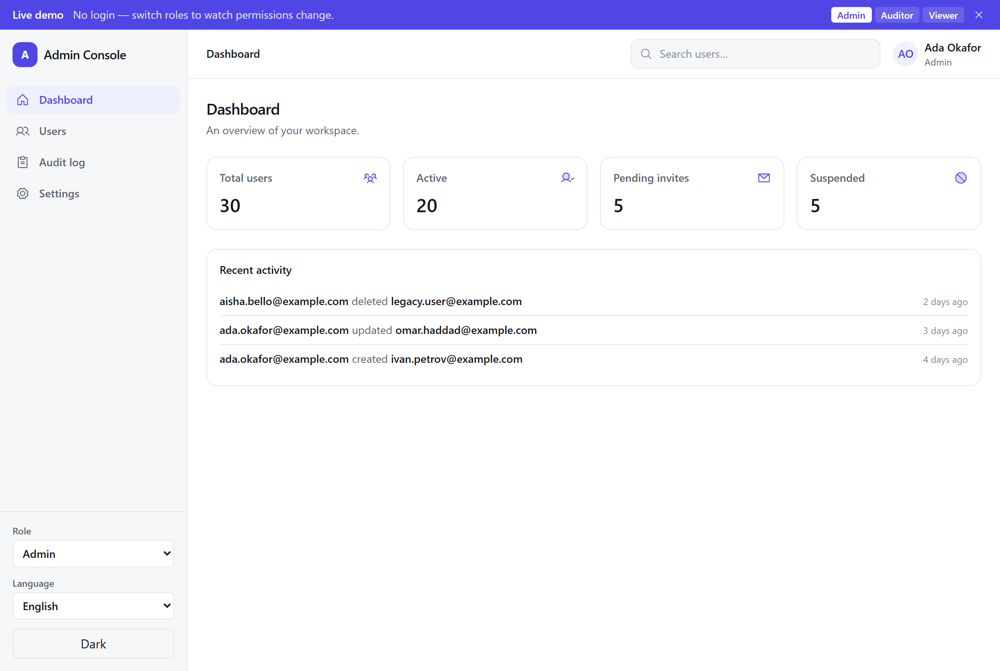
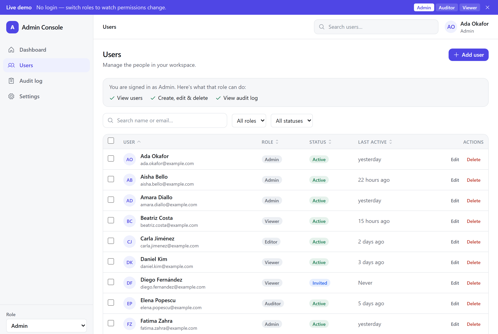
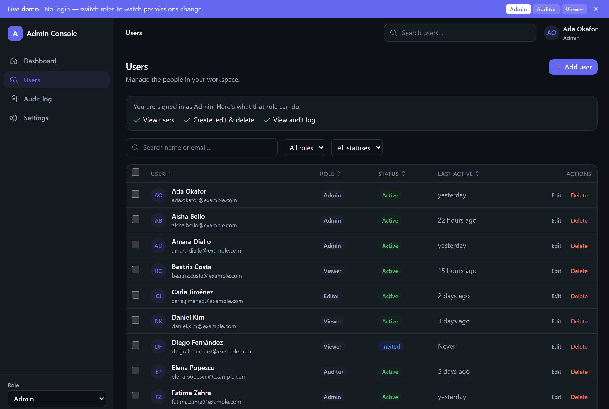
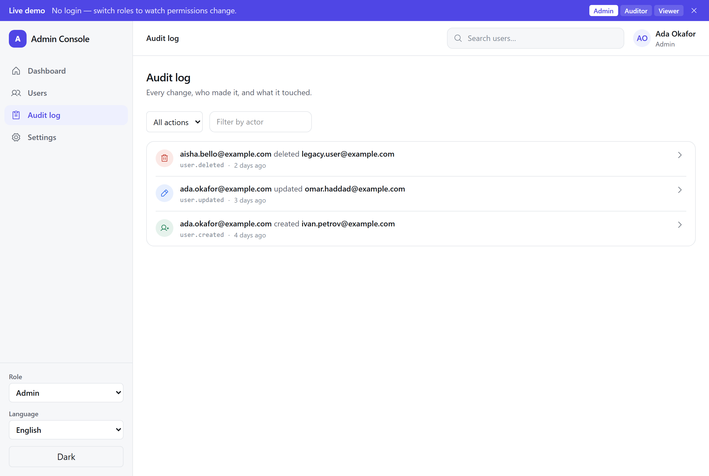
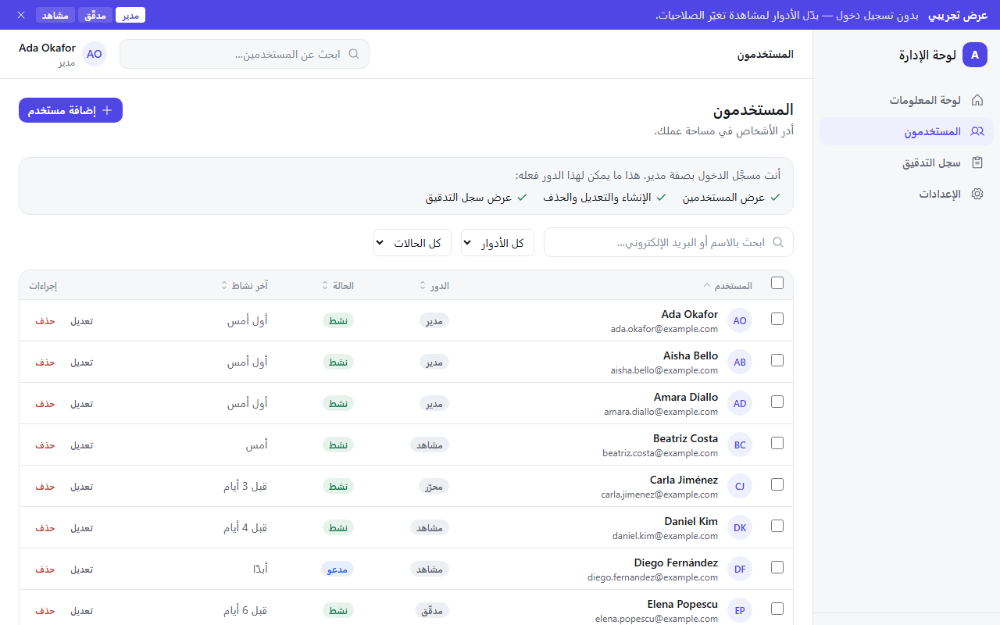
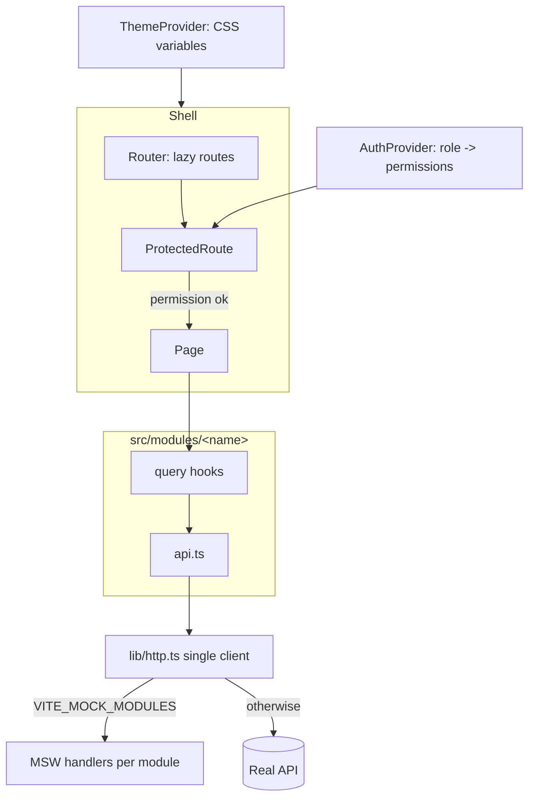

# react-admin-console-starter

[](https://github.com/adeelism/react-admin-console-starter/actions/workflows/ci.yml)
[](./LICENSE)

A production-shaped **admin console starter** — React 19 · TypeScript · Vite · Tailwind CSS v4 ·
TanStack Query · React Router · MSW · i18next. Module-first structure, a permission model you
can watch working, a URL-synced data table, modal forms with validation, toasts, an audit log
wired to real actions, and designed loading / empty / error states — all backed by a Vitest suite.

**▶ Live demo: https://react-admin-console-starter.vercel.app/dashboard** — no login; use the demo banner
to switch roles and watch the UI change.

> It's a **starter**, not a product: no component library, an in-browser mock data layer behind a
> single typed client, and a small dependency list. Clone it and a new feature is a folder.

## Screenshots

| Dashboard | Users |
| --- | --- |
|  |  |

| Users (dark) | Audit log |
| --- | --- |
|  |  |

| Users — Arabic (RTL) |
| --- |
|  |

## What's in it

- **Dashboard** — stat cards plus a recent-activity feed pulled from the audit log.
- **Users table** — debounced search, role/status filters, sortable columns, pagination with a
  page-size selector, bulk selection, and **URL-synced state** (a filtered/sorted view is a
  shareable link that survives a refresh).
- **Modal forms** — create/edit with **React Hook Form + Zod**, inline validation, submit disabled
  until valid. **Toasts** on success/failure and a **confirmation dialog** for destructive actions.
- **Permissions, made visible** — a role note whose capabilities flip live, permission-gated nav /
  actions / routes, and a viewer who genuinely can't reach edit paths.
- **Audit log** — a filterable timeline (by action and actor) with an expandable before/after diff;
  actions on the Users page show up here.
- **States by design** — loading skeletons, first-run and no-match empty states, recoverable errors.
- **Accessible** — keyboard-navigable, visible focus rings, `aria-*`, focus-trapped modal, respects
  `prefers-reduced-motion`.
- **Theming & i18n** — deliberate light/dark via CSS-variable design tokens; every string via `t()`,
  shipping **English and Arabic with full right-to-left** layout (logical CSS, mirrored icons,
  locale-aware dates).

## Architecture



Each feature lives in `src/modules/<name>/` with its own pages, `api.ts`, query hooks, `mocks.ts`,
types, components, and tests. Shared UI lives in `src/components/`. Three things a developer should
find in under a minute: the **seed** (`src/modules/users/seed.ts`), the **permission config**
(`src/auth/permissions.ts`), and the **API boundary** (`src/lib/http.ts`).

```text
src/
  lib/            http.ts (single client) · queryClient.ts · formatRelativeTime.ts
  hooks/          useUrlState.ts (reusable URL <-> state sync)
  auth/           AuthProvider · useAuth · ProtectedRoute · permissions
  theme/          ThemeProvider · ThemeToggle · theme.css (design tokens)
  i18n/           init · locale registry · direction hook (en + ar, full RTL)
  components/
    atoms/        Button · Spinner · Badge · Skeleton
    molecules/    Avatar · PageHeader · StatCard · EmptyState · ErrorState ·
                  ConfirmDialog · RolePermissionNote · DemoBanner · Role/Language switchers
    organisms/    AppLayout · Sidebar · Topbar · Modal
    toast/        ToastProvider · useToast · ToastViewport
  mocks/          registry (per-module toggle) · browser · server
  modules/
    dashboard/    pages · components (RecentActivity)
    users/        pages · components · hooks · api · mocks · seed · types · useUsersTableParams
    audit-log/    pages · components · hooks · api · mocks · store · types
    settings/     pages
```

## Permissions

`AuthProvider` maps a role to permissions; `ProtectedRoute` gates a route on one permission, pages
gate their write affordances, and `RolePermissionNote` shows the current role's capabilities. Switch
roles from the demo banner or the sidebar to see it live. (Managed users additionally carry an
`editor` role as data; the table above is the signed-in user's access.)

| Role | users:read | users:write | audit-log:read |
| --- | :---: | :---: | :---: |
| admin | ✓ | ✓ | ✓ |
| auditor | ✓ | | ✓ |
| viewer | ✓ | | |

## Run it locally

Requires Node 20+ (see `.nvmrc`).

```bash
cp .env.example .env      # mocks on for both modules by default
npm install
npm run dev               # http://localhost:5173
```

With mocks enabled the app runs entirely in the browser — no backend required.

## Swapping the mock layer for a real API

The mock layer sits behind one typed client, so going live is a small, local change:

1. Point `VITE_API_BASE_URL` at your API and set `VITE_ENABLE_MOCKS=false` (or drop the mock env).
2. Confirm each module's `api.ts` paths/shapes match your endpoints (types live in the module's `types.ts`).
3. That's it — pages and hooks don't change; only `src/lib/http.ts` and the `api.ts` files talk to the network.

The MSW worker only starts when `VITE_ENABLE_MOCKS=true`; turn it off (or unset the mock env) and the
app talks to the real API through the same client instead.

## Tests

```bash
npm test          # Vitest + Testing Library + MSW
npm run test:cov  # with coverage (gate at 80%)
```

The suite targets the parts that carry judgement — the permission logic, the `useUrlState` hook, the
table's filter/sort/paginate, the modal + confirm flows, toasts, and the audit store — rather than
coverage theatre. CI runs lint → typecheck → test (coverage) → build on every push and PR.

## Internationalization & RTL

Strings render through `t()` (react-i18next). The app ships **English** and **Arabic with full
right-to-left** layout — genuine mirroring, not string swapping:

- **Direction is data.** A locale registry (`src/i18n/locales.ts`) declares each locale's `dir`; an
  effect hook (`useLocaleDirection`) mirrors the active locale onto `<html lang/dir>` and persists
  it, and a pre-paint script in `index.html` applies it before React mounts so an Arabic reload
  never flashes left-to-right.
- **Logical CSS, not overrides.** Layout uses Tailwind's logical utilities (`ms/me`, `ps/pe`,
  `start/end`, `border-e`, `text-start/end`), so the same markup mirrors under `dir="rtl"` with no
  `[dir=rtl] … {}` rules — and English renders identically to before.
- **Selective icon mirroring.** Only *directional* glyphs flip (`rtl:-scale-x-100` on the pagination
  and expand carets); object icons (search, trash, clock) are left alone.
- **Latin digits in both locales.** Numbers stay Western even in Arabic (`Intl` with the
  `ar-AE-u-nu-latn` extension); only the words around them localize.
- **Reorderable sentences.** The audit "actor · verb · target" line is one interpolated `<Trans>`
  template per action (`AuditSentence`), so Arabic grammar reorders it naturally.

### Adding a locale

1. Add `src/i18n/locales/<code>.json` — copy `en.json` and translate the values, keeping the keys (a
   `keyParity` test fails the build if they drift).
2. Add one entry to `LOCALES` in `src/i18n/locales.ts` (`code`, `nativeName`, `dir`, `resource`).
3. If the locale is right-to-left, add its `code` to the small `dir` check in the `index.html`
   pre-paint script — the one place that can't import the registry.

The switcher, i18n init, and `<html>` wiring all derive from the registry, so there's nothing else
to touch.

## Deploy (Vercel)

The repo is Vercel-ready: `vercel.json` rewrites all routes to `index.html` (SPA routing), and
`.env.production` enables the in-browser mocks so the hosted demo works with no backend.

1. Import the repo in Vercel (framework preset: **Vite** — build `npm run build`, output `dist`).
2. Deploy. No environment variables are required for the demo build.
3. Put the resulting URL in this README and the repository description.

## Decisions and trade-offs

- **Module-first over layer-first.** Co-locating a feature's routes/api/hooks/mocks keeps changes
  local; the cost is a little boilerplate per module, repaid as modules multiply.
- **URL as the source of truth for table state.** `useUrlState` makes views shareable and refresh-safe;
  the table sends params to the (mock) server rather than filtering on the client, so the boundary is
  already server-shaped.
- **No component library.** Tailwind design tokens + a handful of primitives keep the bundle small and
  the code readable — the point of a starter.
- **MSW as the single mock source.** The same handlers serve the browser (per-module toggle) and the
  tests, and a shared audit store lets a write on one page appear on another — so mocks can't drift.
- **Logical CSS over `[dir=rtl]` overrides.** One set of direction-agnostic utilities mirrors for
  free and can't fall out of sync with a separate LTR rule; RTL is wiring, not a second stylesheet.
- **Latin digits in both locales.** Admin data is scanned, sorted, and compared — consistent Western
  figures read faster here than Arabic-Indic ones, so only the words localize.
- **Only directional icons mirror.** A caret means "next / previous" and must follow reading order; a
  trash, search, or clock glyph means the same thing in any direction and stays put.
- **Custom permission context**, not a router loader — explicit, testable, and ready for a real auth
  backend behind `AuthProvider` (pairs with [`nestjs-cognito-auth-starter`](https://github.com/adeelism/nestjs-cognito-auth-starter)).
- **`App.tsx` excluded from coverage** — pure composition, covered indirectly by layout/router/page tests.

## License

[MIT](./LICENSE)
