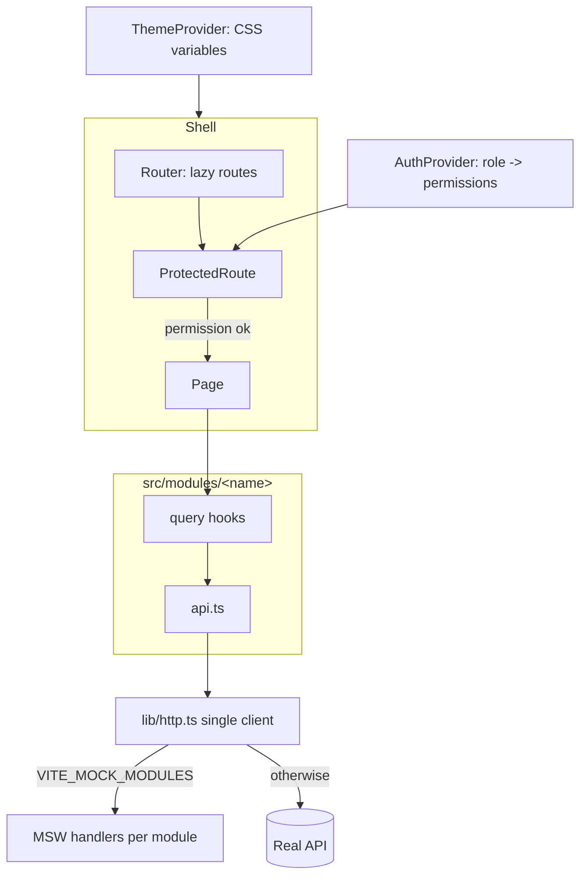

# react-admin-console-starter

[](https://github.com/adeelism/react-admin-console-starter/actions/workflows/ci.yml)
[](./LICENSE)

A React 19 + TypeScript + Vite admin console starter. It demonstrates a **module-first**
structure layered on **atomic-design** shared components, permission-gated lazy routes,
TanStack Query over a single HTTP client, per-module MSW mocking, i18next, and CSS-variable
theming — with a Vitest + Testing Library suite and a coverage gate.

## Why this exists

Admin consoles grow by adding modules, not by adding pages to one bucket. This starter
puts each feature in `src/modules/<name>/` with its own routes, API layer, query hooks,
mocks, and locale keys, while shared UI lives in `src/components/{atoms,molecules,organisms}`.
The result is a codebase where a new module is a folder, not a diff across ten shared files.

Two supporting decisions make it demonstrable in isolation:

- **One HTTP client.** Every module's API functions go through `src/lib/http.ts`. Swap the
  base URL (or the client) in one place.
- **MSW mocking, toggled per module.** `VITE_MOCK_MODULES=users,audit-log` decides which
  modules are served by mocks, so you can develop one module against fakes while another
  talks to the real API. The same handlers back the test suite.

It pairs with [`nestjs-cognito-auth-starter`](https://github.com/adeelism/nestjs-cognito-auth-starter):
the `AuthProvider` here can be backed by that service's tokens later without changing consumers.

## Architecture



## Structure

```text
src/
  lib/            http.ts (single client) · queryClient.ts
  auth/           AuthProvider · useAuth · ProtectedRoute · permissions
  theme/          ThemeProvider · useTheme · ThemeToggle · theme.css (CSS vars)
  i18n/           init + locales (en + xx stub)
  components/     atoms/ · molecules/ · organisms/ (Button, Input, DataTable, AppLayout…)
  mocks/          registry (per-module toggle) · browser · server
  modules/
    users/        pages · api · hooks · mocks · types
    audit-log/    pages · api · hooks · mocks · types
```

## Permissions

`AuthProvider` maps a role to permissions; `ProtectedRoute` gates a route on one permission,
and pages hide write affordances the user lacks. A role switcher in the header lets you see
the gating live.

| Role | users:read | users:write | audit-log:read |
| --- | :---: | :---: | :---: |
| admin | ✓ | ✓ | ✓ |
| auditor | ✓ | | ✓ |
| viewer | ✓ | | |

## Run it locally

Requires Node 22 (see `.nvmrc`).

```bash
cp .env.example .env      # mocks on for both modules by default
npm install
npm run dev               # http://localhost:5173
```

With mocks enabled the app runs entirely in the browser — no backend required.

## Run the tests

```bash
npm test          # Vitest + Testing Library + MSW
npm run test:cov  # with coverage (gate at 80%)
```

CI runs lint → typecheck → test with coverage → build on every push and PR.

## Decisions and trade-offs

- **Module-first over layer-first.** Co-locating a feature's routes/api/hooks/mocks keeps
  changes local; the cost is a little boilerplate per module, paid back as modules multiply.
- **Custom permission context, not a routing library's loader.** Keeps the gate explicit and
  testable, and lets a real auth backend slot in behind `AuthProvider`.
- **MSW as the single mock source.** The same handlers serve the browser (per-module toggle)
  and the tests, so mocks can't drift from what's tested.
- **CSS variables for theming.** No runtime theme library; the toggle flips one
  `data-theme` attribute.
- **`App.tsx` excluded from coverage.** It is pure composition (providers + `RouterProvider`);
  its behaviour is covered via the `AppLayout`, router, and page tests.

## License

[MIT](./LICENSE)
